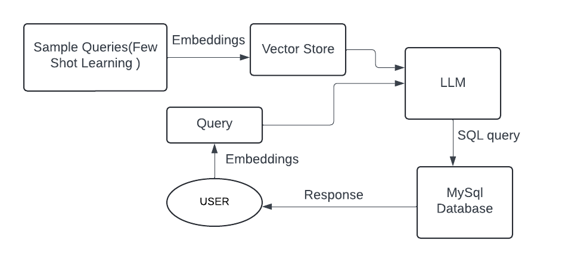
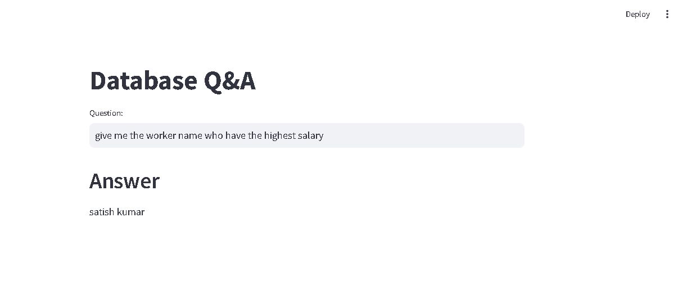

## Project Overview:
An organization maintain information about its workers in MySQL database. Our system allows users to ask questions in natural language, which are then converted into SQL queries using Google GenerativeAI model and LangChain . This intelligent system executes the queries on the MySQL database to generate accurate responses.

## 🔧 Technologies Used:

*Google GenerativeAI LLM*: For natural language processing and query generation.

*LangChain's SQLDatabaseChain*: To integrate the model with the MySQL database.

*Hugging Face Embeddings*: For enhanced semantic understanding.

*Streamlit*: For building a user-friendly interface.

*Chromadb*: As a vector store for efficient data retrieval.

*Few-Shot Learning*: Implemented to fine-tune the model for more precise results.

